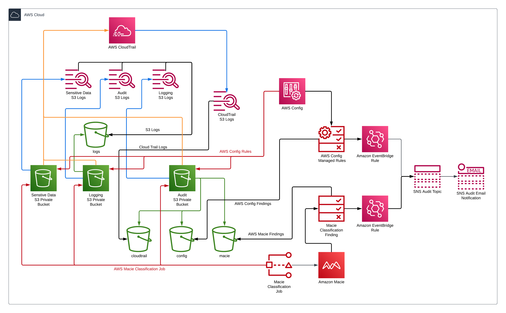
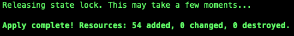

# Amazon S3 Security

## Use TerraForm to build the following:
* Amazon S3 Buckets
* AWS CloudTrail
* AWS Key Management Service (KMS)
* Amazon Macie
* AWS Config
* Amazon Simple Notification Service (SNS)
* Amazon Eventbridge
* IAM policies and roles
## Set variables in locals.tf
* aws region
* aws profile
* tags
* s3 bucket prefix name
## Update S3 Backend in provider.tf
* bucket
* key
* profile
* dynamodb_table
## Run Terraform
1. Run the following Terraform commands
    ```
    terraform init
    terraform validate
    terraform plan -out=plan.out
    terraform apply plan.out
    ```
2. Check Terraform apply results
    
    

## Validate Amazon S3 Settings
## Validate AWS Macie
## Validate AWS Config
## Test changing AWS S3 Bucket 
## Clean up Terraform
```
terraform state rm aws_macie2_classification_job.macie
terraform destroy
```
